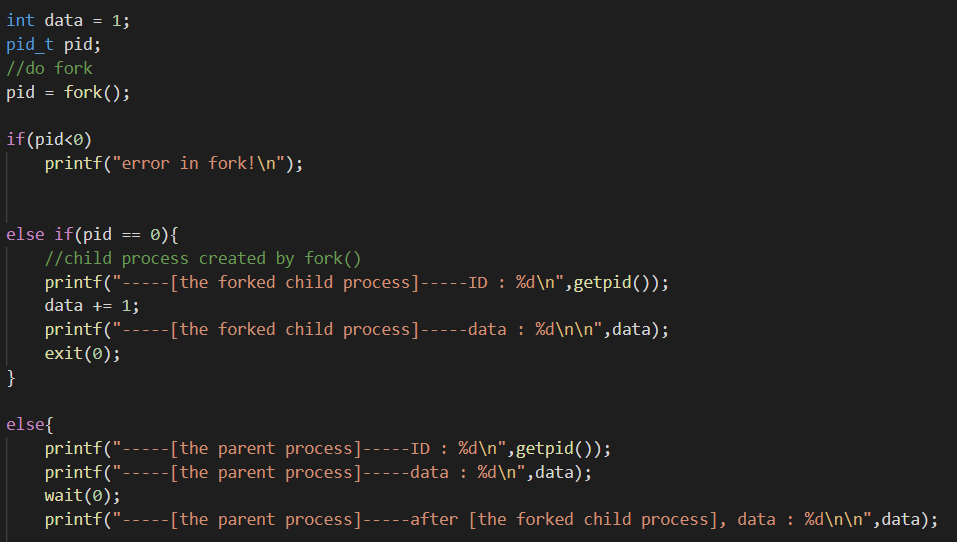
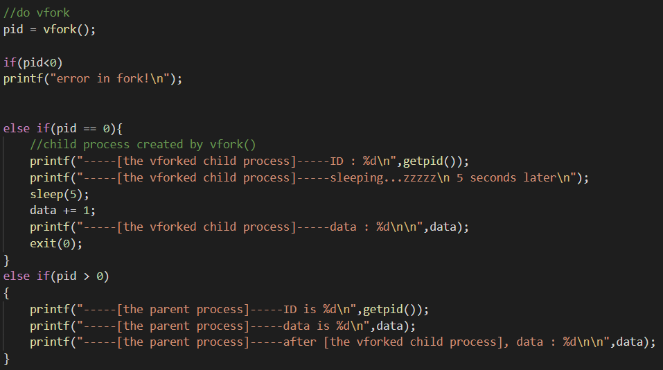
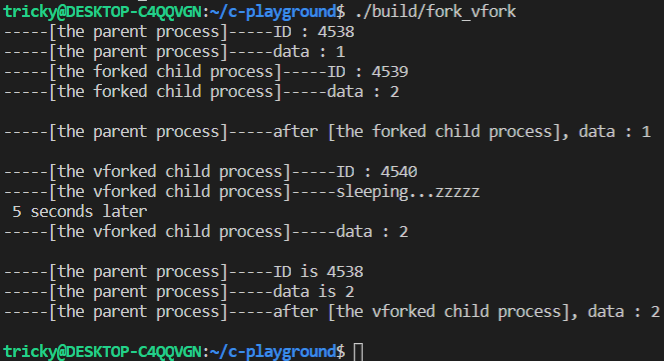
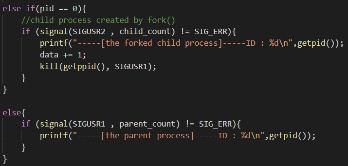
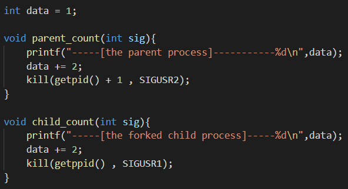
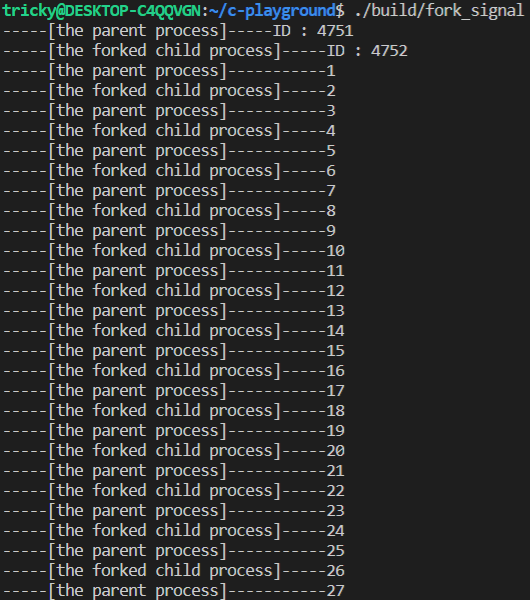
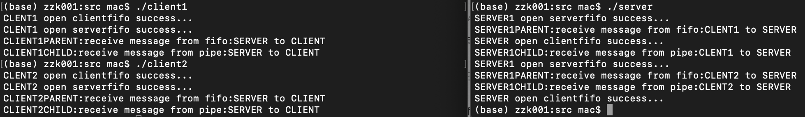

# 多进程编程

### 组名：999errors
### 组员：张子开 蒲果

## 一、实验目的
#### 1.学会创建多进程程序，理解fork()，vfork() 创建的子进程的特点。
#### 2.学会使用有名管道和无名管道实现进程间通信。
#### 3.学会使用信号机制实现进程间通信。

## 二、实验内容
#### 1.编写fork()，vfork()多进程程序，通过输出结果比较所创建的子进程的不同之处。
#### 2.编写fork()多进程程序，进程间模拟信号通信，包括信号发送、捕捉与处理。
#### 3.编写fork()多进程程序，进程间实现有名管道和无名管道通信。具体要求如下：
(1)编写1个服务器程序server.c和2个客户端程序client1.c,
client2.c ，服务器和客户端之间采用FIFO管道通信；
(2)服务器和客户端各自创建自己的子进程，父进程负责
完成FIFO管道通信，子进程负责输出接收到的信息，
父子进程间采用无名管道通信。 

## 三、实验过程与结果
#### 1.fork_vfork.c 比较fork()与vfork()所创建子进程的区别
首先，我们先在父进程中定义一个数据(int data = 1;)
然后使用fork()子进程1，并在这个子进程中修改数据(data += 1;), 随后在分别打印父子进程中的data，父进程需调用wait()等待fork子进程退出，否则可能会先行执行。

之后，我们再使用父进程通过vfork()创建子进程2，并在这个子进程中修改数据(data += 1;),随后在分别打印父子进程中的data，vfork子进程在打印之前睡眠了5秒，看看父进程是否会等待vfork()子进程

#### 执行结果：fork子进程1修改data后父进程中data仍为1，说明fork的子进程和父进程只共享代码段，不共享数据段。而vfork子进程修改data后父进程中data已经变为了2，说明vfork的子进程和父进程既共享代码段，也共享数据段，在vfork睡眠未退出时，父进程没有执行，说明父进程需要等待vfork子进程退出才会继续执行。

#### 2.fork_signal_kill.c 实现了父子进程通过信号交互实现交替数数
首先定义全局数据(int data = 1;)，然后使用fork()创建子进程，使用signal函数将父进程与SIGUSR2绑定，将子进程与SIGUSR1绑定

然后分别定义父子进程的signal handler，功能都是先打印data，然后将data+2，然后使用kill通知对方打印下一个数

#### 执行结果：这样就实现了父子进程通过信号交互的交替数数功能。

#### 3.fork_pipe_client.c fork_pipe_server.c

#### 执行结果：

## 四、实验总结

## 五、附实验源码

#### 源码请见 https://github.com/TrickyGo/999errors/tree/master/homework2-%E5%A4%9A%E8%BF%9B%E7%A8%8B%E7%BC%96%E7%A8%8B/homework2_project/src
