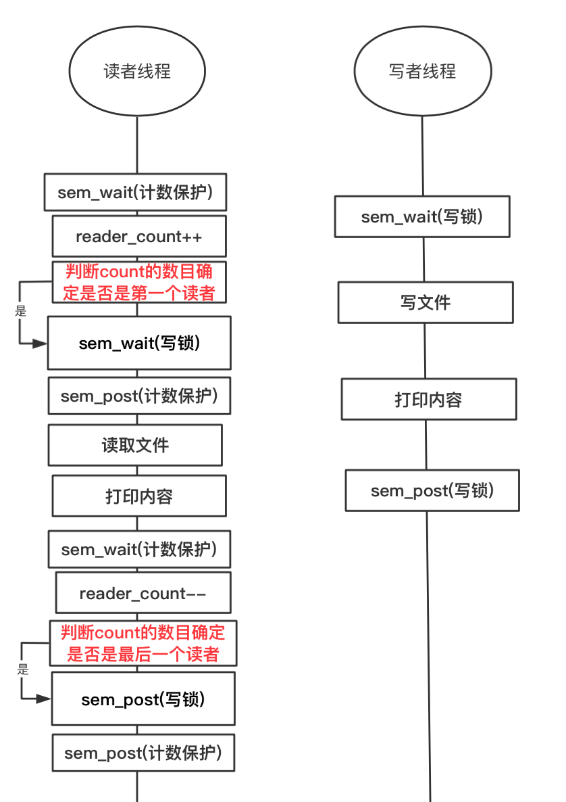
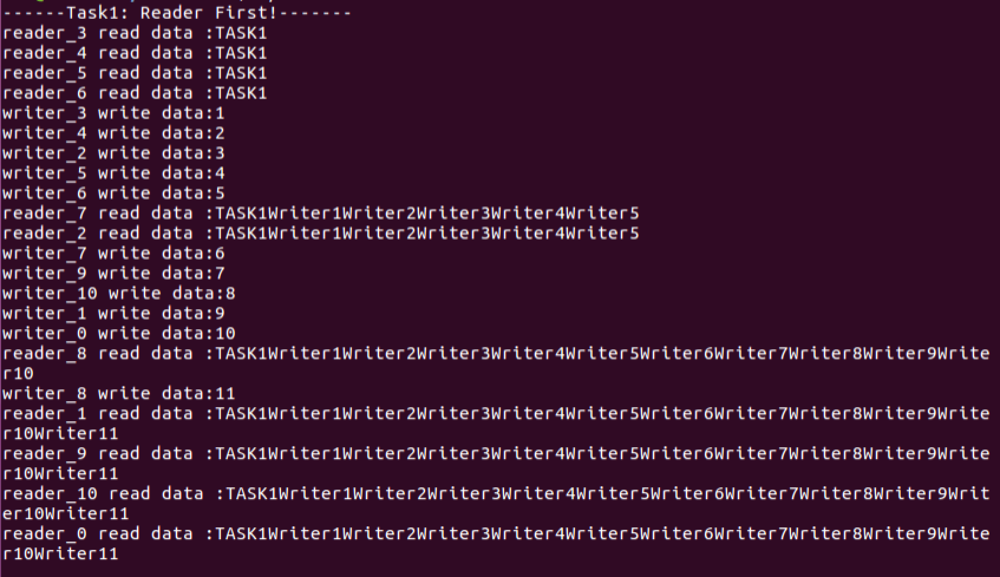
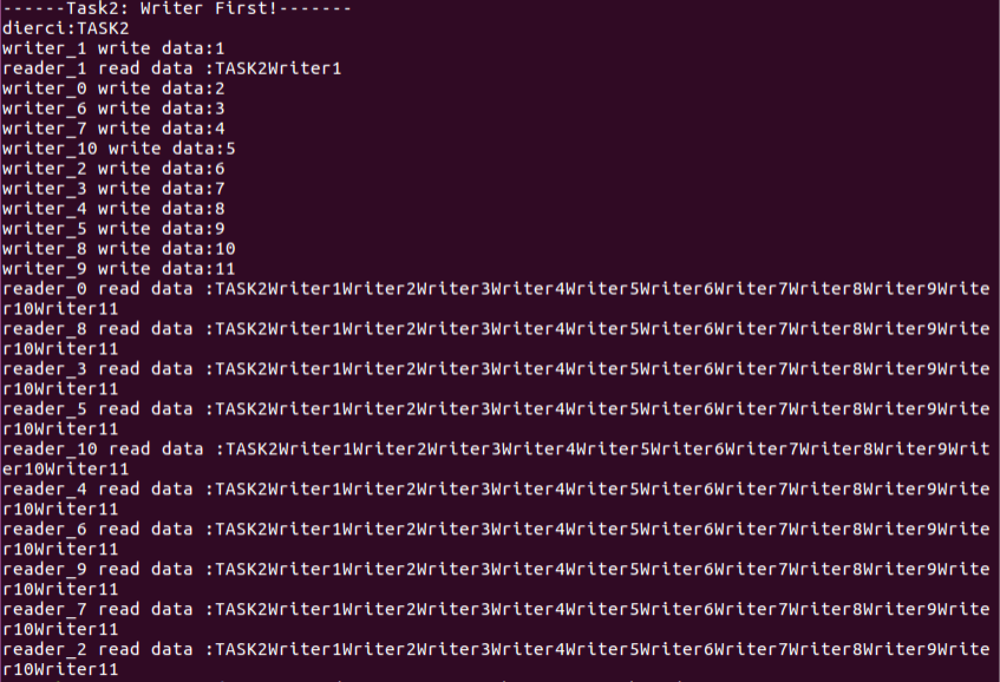
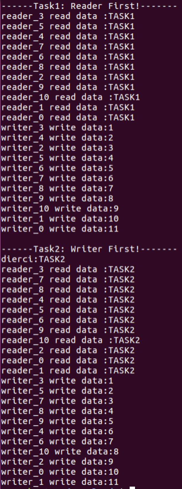

# 多线程编程

### 组名：999errors
### 组员：张子开 蒲果

## 一、实验目的
#### 1.掌握基于pthread线程库的多线程编程技术。 
#### 2.掌握基本的线程间同步技术(sem，mutex)。
#### 3.理解共享资源并掌握其操作方法。

## 二、实验内容
### 一个数据集(如数据、文件等)被N个线程读写;
##### 一些线程只要求读数据集内容，称为读者 (Reader)，实验读者数 不少于6个;
##### 另些线程要求修改数据集内容，称为写者 (Writer)，实验写者数 不少于3个;
### 多个读者可以同时读数据集内容，不需要互斥操作;
##### 一个写者不能和其他写者或读者同时访问数据集，换句话说，写者和其他写者或读者之间必须互斥操作!
### 读者优先:如果有读者，写者需要等待!用于更新不频繁或更新 影响不显著、读者较多的场合;
### 写者优先:如果有写者，读者需要等待!用于更新频繁或更新影 响显著的场合。

## 三、实验过程与结果
#### 1.通过流程图对实验流程进行解析：

整个程序由三部分组成：主程序，读者线程，写者线程。
##### 主程序中创建线程参数（pthread_attr_init）一个优先级高的参数，一个优先级低的参数-〉初始化信号量-〉创建线程（pthread_join）-〉回收线程（pthread_join）（由于主程序就一条直线，所以没在图中表示）
##### 读者线程：主要通过一个计数保护信号量保护一个count变量，通过对count变量判断是否为读者线程的第一个或者最后一个来申请或者释放写锁。（这个对于count变量的判断是我们认为的对于实现读并发且不影响读写互斥的关键步骤）
##### 写者线程就是等待写锁，写文件，释放写锁即可

### 实验结果如下：

## 四、实验总结
这次实验遇到的的问题有两个：
#### 一是，在设置优先级的时候发现没有效果，经过调研才发现默认的线程调度是固定优先级不能改的，所以我们在设置线程参数的时候通过：
### ret=pthread_attr_setschedpolicy (&attr_high, SCHED_FIFO);
#### 这个代码将线程调度方式设置为FIFO，然后就可以通过设置优先级设置读者优先还是写者优先，
#### 二是，我们在测试的时候，如果读者时间长，那么会造成写者线程无法抢占，因为只判断第一个读者和最后一个读者，导致读者一直占用写锁，这个问题出现在我在读者读取文件后，sleep（3），读的时间就变长，导致问题，暂未解决。
问题重现图片如下：

## 五、附实验源码

#### 源码请见 https://github.com/TrickyGo/999errors/blob/master/homework3_多线程编程/Reader_Writer_Semaphore.c
