# 构建主机端开发环境(下)

### 组名：999errors
### 组员：张子开 蒲果

## 一、实验目的
#### 1.学会下载安装Linux及相关工具到目标机或目标机仿真环境。  
#### 2.学会使用交叉编译器编译应用程序，并能够将可执行程序下载到目标机运行。 
#### 3.学会使用交叉调试工具gdb-gdbserver调试应用程序。 

## 二、实验内容
### Host-Target 方案1：下载安装Linux系统到开发板，其中包括bootloader、内核、模块、库、文件系统等；建立host-target连接 ，常见连接有SSH，VNC，Putty。 
### Host-Target 方案2：下载安装目标机仿真环境qemu，安装qemu树莓派系统。
### 构建并测试开发板交叉编译器。 
### 建立gdb-gdbserver交叉调试环境并能够调试应用程序。 

## 三、实验过程与结果

### 1.通过qemu仿真树莓派系统
安装qemu：

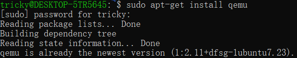

下载树莓派系统镜像后 使用指令启动树莓派系统

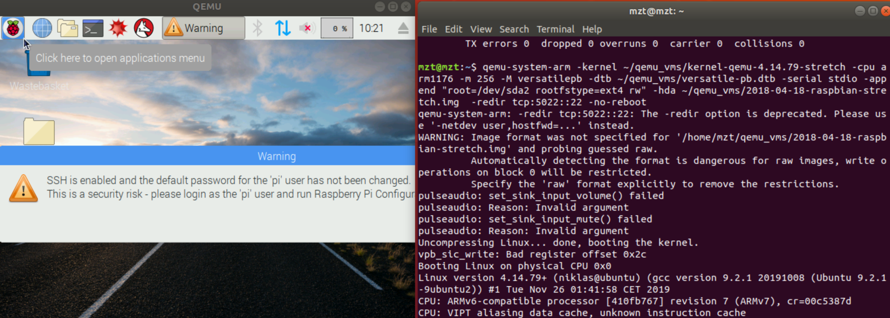

### 2.交叉编译应用程序，并使用qemu-arm执行

首先编写一个简单的c应用程序cal_avg.c
安装arm的交叉编译工具链：

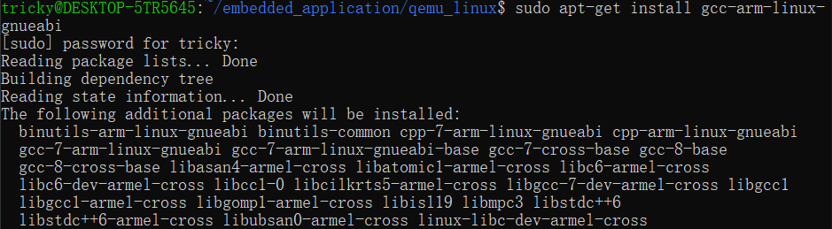

使用arm-linux-gnueabihf-gcc编译该程序

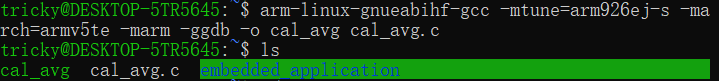

可以看到生成了可执行程序cal_avg, 我们试试直接用x64的host端执行

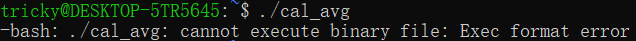

发现无法执行，因为architecture不同
我们使用qemu-arm模拟arm架构再次执行

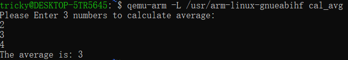

正常地执行并输出了结果，这样就实现了x64架构到arm架构地交叉编译执行应用程序
### 3.gdb-gdbserver交叉调试
使用qemu-arm -g来模拟target端的gdbserver，端口设置为1234

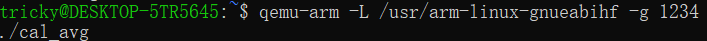

此时target端的gdbserver进入监听状态。

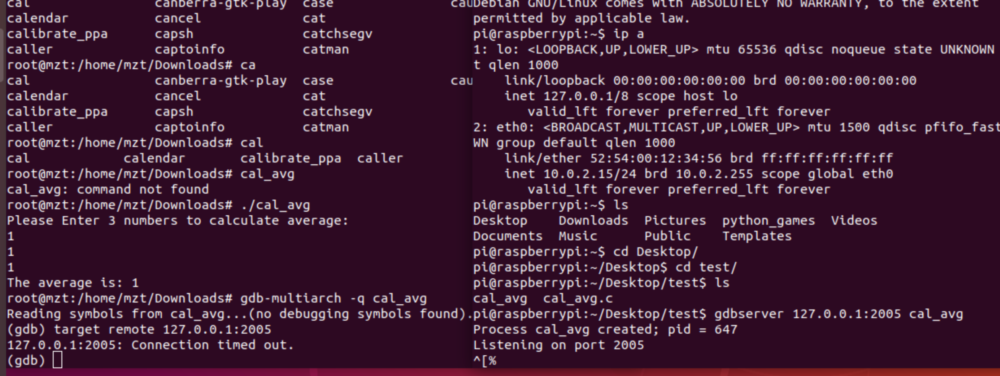

在host端，我们启动gdb-multiarch

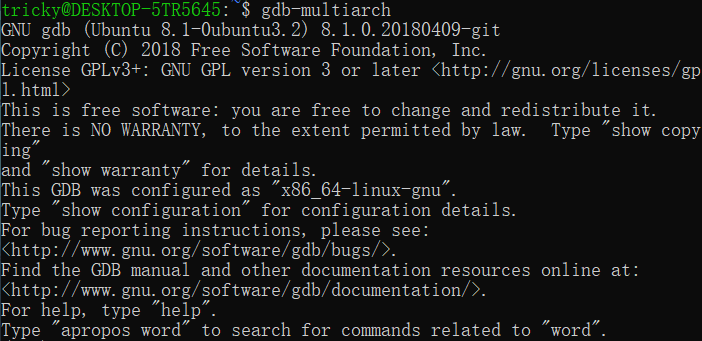

设置调试的可执行文件、架构等

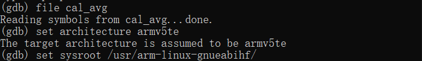

执行target remote localhost:1234对target端的gdbserver进行连接

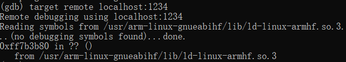

这样就连接成功了，接下来可以进行对该应用程序的调试了
我们使用break添加断点、使用continue进行执行

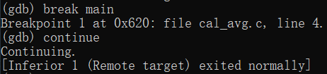

再回头看target端，成功地被调试、执行

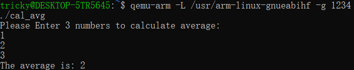
## 四、实验总结
通过实验，我们学会了通过gdb-multiarch和gdbserver进行配合，在主机端对目标板进行调试。从中我们学到了如何进行交叉编译，调试，为以后的开发奠定了基础。

## 五、附实验源码

#### 源码请见 https://github.com/TrickyGo/999errors/blob/master/
