# 构建目标系统

### 组名：999errors
### 组员：张子开 蒲果

## 一、实验目的
#### 1.掌握裁剪Linux内核的方法，理解内核选项的意义；
#### 2.熟悉编译内核并加载内核到目标系统的方法与过程；
#### 3.了解模块与内核的关系，掌握内核模块配置编译、安装与卸载流程，为进一步编程，如驱动编程打下基础；
#### 4.掌握创建、安装(卸载)并使用文件系统的方法。

## 二、实验内容
### 1.首先用默认配置重新编译一遍已安装到开发板的内核，将新的内核替换现有内核，检查是否通过！
### 2.在原始版本基础上，重新配置Linux内核，构建一个嵌入式的Linux内核；
### 3.编译安装重新配置后的内核、模块及dtbs设备树；
### 4.针对默认配置中不少于10个kernel feature进行重新配置（裁剪为主、偶有增加），并解释理由；(Y=>N，N=>Y)
### 5.保留必要的模块安装，剩余(占多数)取消；(M=>N)
### 6.make后将新的内核安装到开发板运行测试；
### 7.选择至少二个模块加载与卸载，检查是否加载、卸载成功；
### 8.构建并安装至少一款不同于根文件系统、用于应用开发的其它文件系统。

## 三、实验过程与结果

### 1.编译linux内核
下载linux内核源码并解压

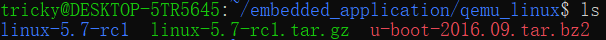

可以在arch/arm/configs 目录里找到各个厂商的内核配置文件

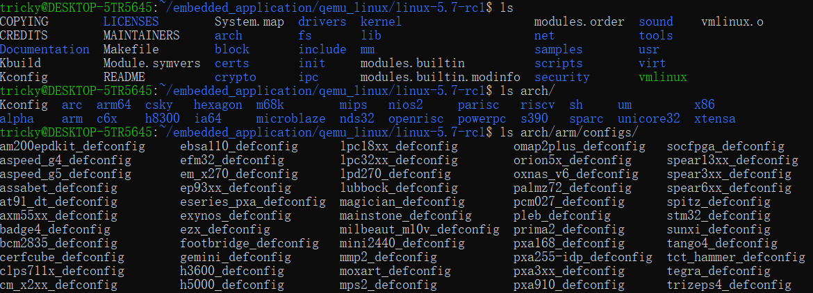

配置交叉编译Makefile，修改ARCH为arm，CROSS_COMPILE为arm-linum-gnueabi

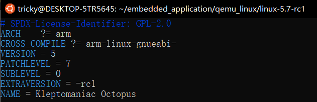

编译配置文件

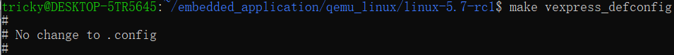

配置系统

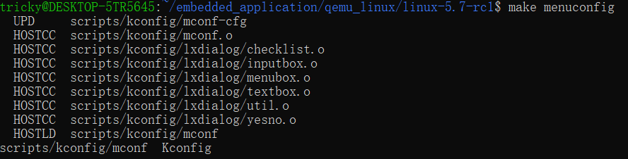

配置界面, 在这里我们可以裁剪内核，具体裁剪内容请见（三、5.）小节

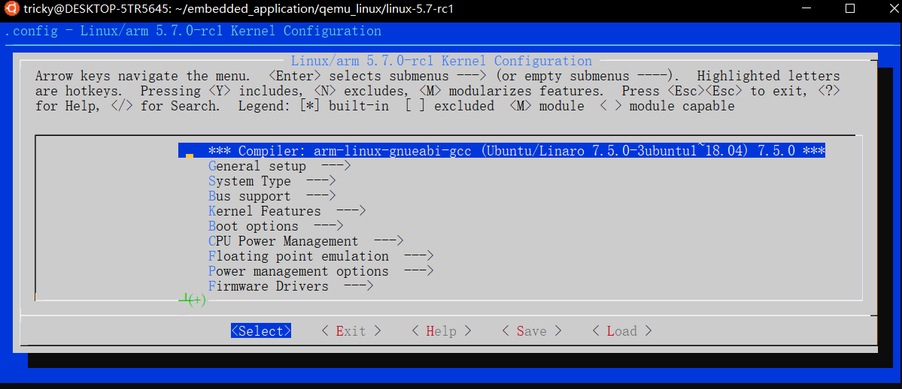

配置NFS

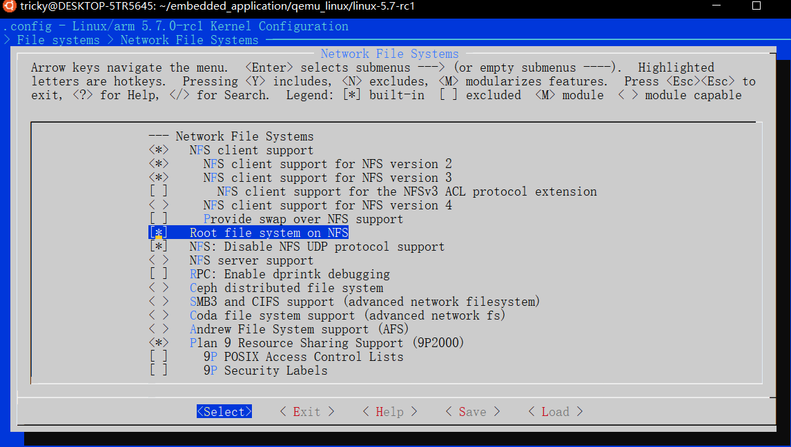

编译内核

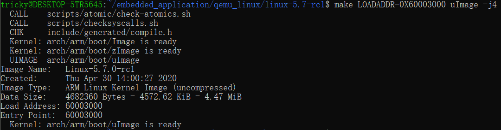

### 2.配置ubuntu 和 qemu 的网络环境以及u-boot
因为要通过网络来从主机下载内核并由u-boot引导启动、加载根文件系统，
首先安装tftp

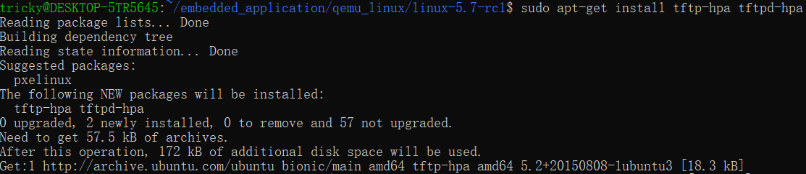

配置tftp环境

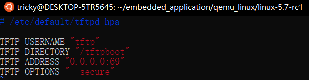

启动tftp服务器

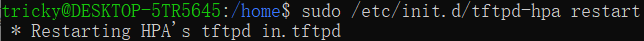

下载并解压u-boot

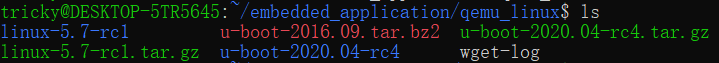

编译u-boot config文件

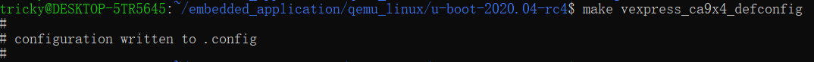

配置u-boot架构为arm

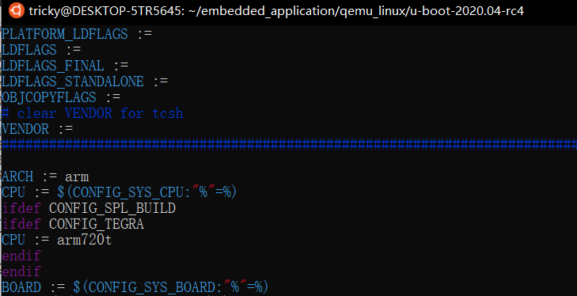

编译u-boot

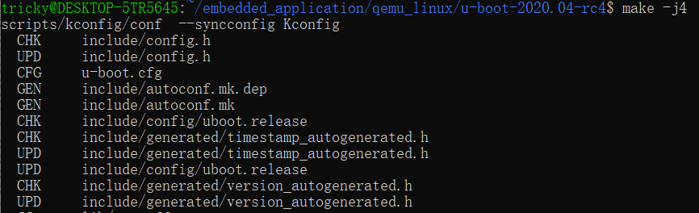

### 3.制作根文件系统
下载buildroot工具(基于busybox)

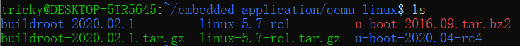

生成用于qemu的arm config文件

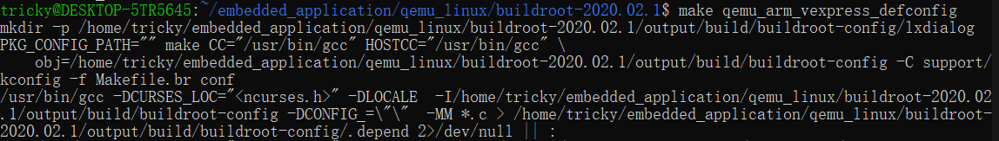

对源码进行配置

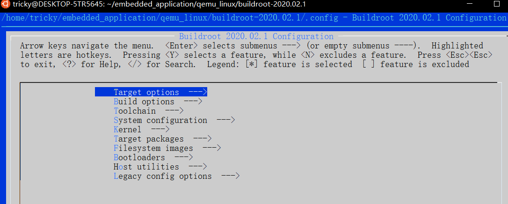

配置文件系统root密码

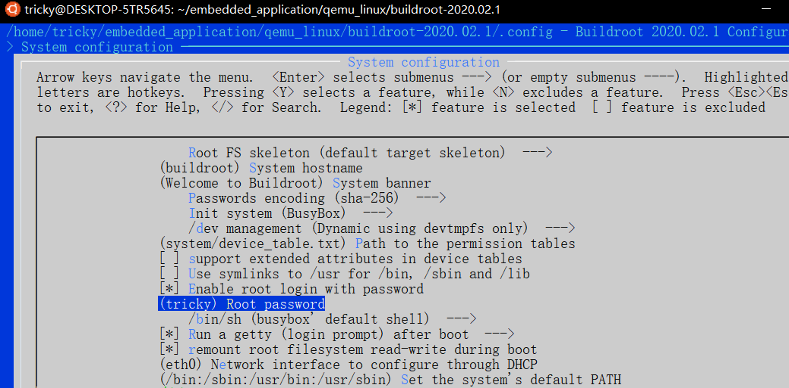

选择Filesystem images

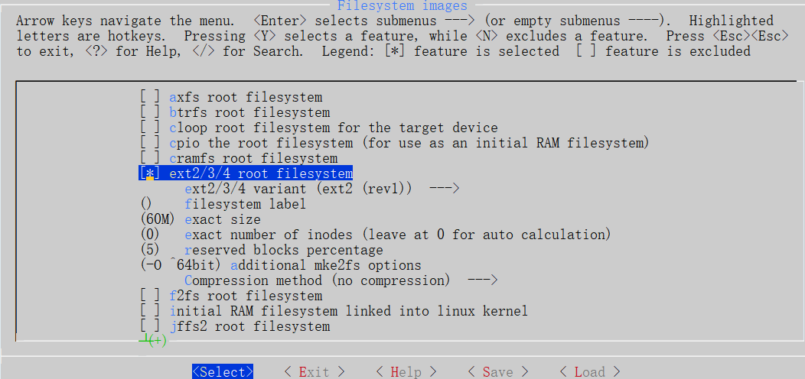

这里我们选择了ext2

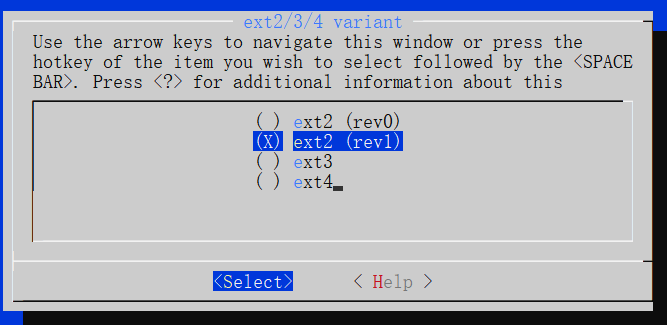

接下来编译即可生成文件系统

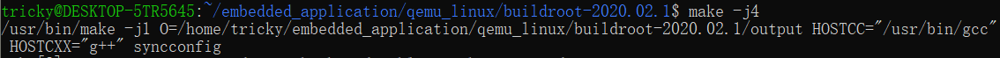

### 4.现在我们自定义的linux kernel, u-boot, 根文件系统都准备就绪了，接下来使用qemu启动

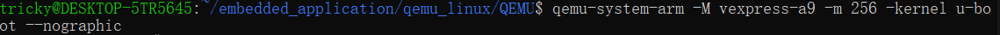

可以看到U-boot成功启动

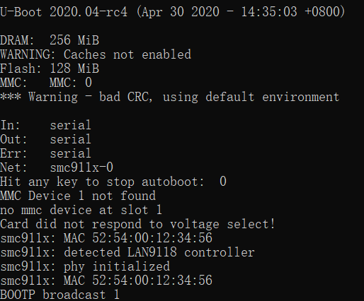

Linux Image也加载成功

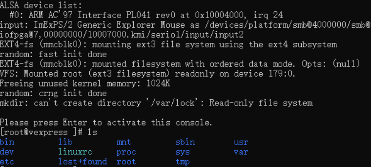

### 5.内核的裁剪

Code maturity level options ---> 
这代表还在开发或者还没有完成的代码与驱动，不选。

General setup—〉System V IPC
这项是组系统调用及函数库，它能让程序彼此间同步进行交换信息。某些程序以及DOS模拟环境都需要它。为进程提供通信机制，这将使系统中各进程间有交换信息与保持同步的能力。这项是必要的，选择。

Block layer-----〉
我们暂时不使用任何外设，所以不选。

Power management options (ACPI, APM) ---> 
这项表示电源管理的调试信息支持，我们不调试内核有关电源管理部份，所以不选择这项。

Networking options --->
在网络选项里，我们只需要Unix domain sockets和TCP/IP networking，其余均不需要

file systems --->
Second extended fs support
Ext2 extended attributes
Ext2 POSIX Access Control Lists
Ext2 Security Labels
Ext3 journalling file system support
Ext3 extended attributes
Ext3 POSIX Access Control Lists
Ext3 Security Labels 
这些都是linux的标准文件系统，理论上我们可以只选择用到的文件系统，但是不排除系统之后会mount其他文件系统的可能性，所以这里都选上。

language support --->
暂时没有构建汉语相关应用的需求，这里只选english支持。

Security options --->
暂时没有高级别安全防护需求，这项可不选。

## 四、实验总结
本次实验我们从linux源代码开始重新构建、自定义了linux内核，自定义了u-boot，自定义了根文件系统，并将三者结合组成了定制的linux系统，最终通过qemu模拟该系统的运行。在自定义时，我们进行了kernel feature以及module的裁剪，对linux系统组成有了更充分的了解。

## 五、附实验源码

#### 源码请见 https://github.com/TrickyGo/999errors/blob/master/
