# 构建目标系统

### 组名：999errors
### 组员：张子开 蒲果

## 一、实验目的
#### 能够综合应用课程所学的技术与工具，包括：
#### 1.Socket通信
#### 2.多进程、多线程编程
#### 3.交叉调试目标端程序
#### 4.磁盘分区与文件系统创建
#### 5.模块与驱动编程

## 二、实验内容
### 1.将树莓派设为智能家居Linux服务器，可用来采集并维护环境数据，如PM2.5、温度、湿度、气味、电器状态数据等。在实际环境中数据来自相应的传感器，本次试验中用scull设备模拟。有条件的小组鼓励使用真实设备采集数据。
### 2.要求创建2个以上的scull设备，设备驱动可选择从内核源码树外(Kbuild)编译安装，或加入到内核源码树内。驱动函数要求包括： open, release, read, write, llseek, ioctl。
### 3.实验中的环境数据存储在特定文件系统中。该文件系统要求具备属性：在线写入、持久性、断电可靠性

## 三、实验过程与结果

### 1.系统总体设计
我们的智能家居数据通信系统总体设计见下图：

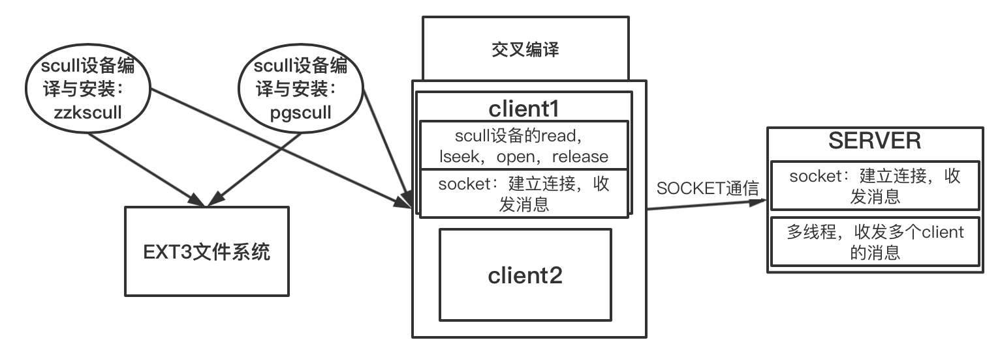

### 2.ext3文件系统构建
首先fdisk -l查看硬盘：可以看见/dev/sdb盘用来做储存实验数据的文件系统盘。

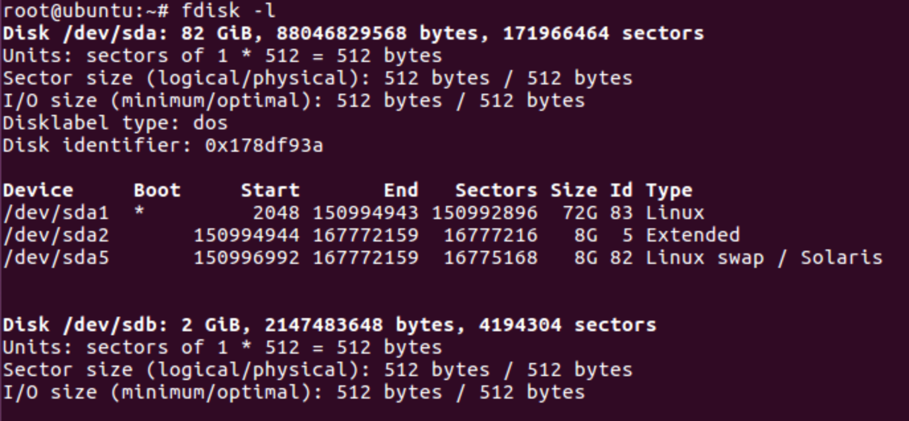

用fdisk /dev/sdb 来创建分区

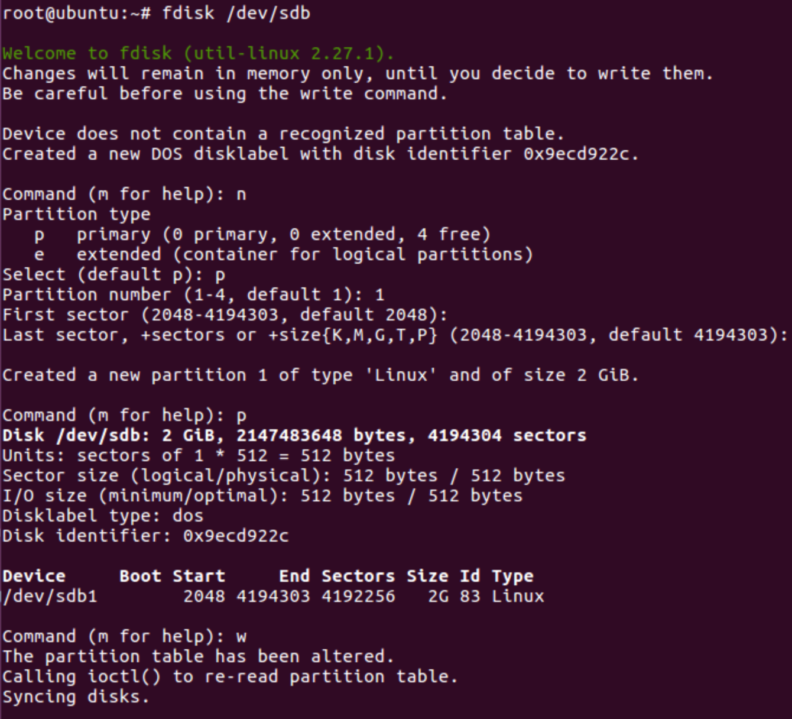

格式化分区为ext3文件系统。由于老师要求的文件系统具有在线写入、持久性、断电可靠性，但是ext3的是不具有持久性的，但是符合要求的JFFS2和YAFF2文件系统没能构建成功，所以只构建了ext3文件系统。
如下将做好的ext3系统挂载到/mydata目录。

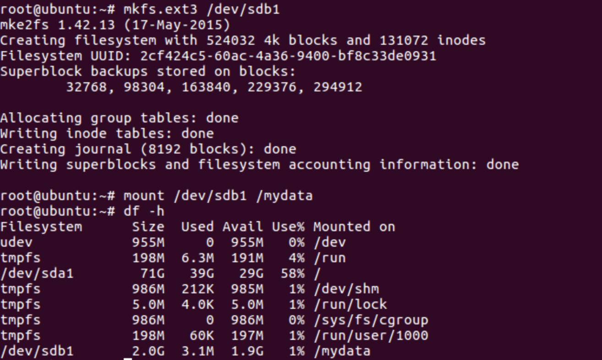

### 3.scull模块驱动编程设计
首先查看自己的linux内核的版本，在终端中输入： uname -r
选择同自己内核相应的linux-source版本安装。在终端中输入：sudo apt-get install linux-source-4.15.0
下载完毕后在/usr/src/下有个名为linux-source-4.15.0 的文件夹，在该文件夹里面有linux-source-4.15.0.tar.bz2    ，解压到/usr/src/linux-source-4.15.0/目录下。解压方法,在终端中输入: sudo -i 切换到根用户下,定位到/usr/src/linux-source-4.15.0/目录下，在终端中输入：tar jxvf linux-source-4.15.0.tar.bz2。解压得到文件源代码文件，该源代码文件夹名称为linux-source-4.15.0，进入该目录
开始配置内核，选择最快默认方式：在终端中输入：make oldconfig，其中也会有很多需要填y/n/m的直接回车即可。
然后在文件中进行make和make modules指令。
（遇到问题：由于内存区空间不足，硬盘空间不足两个问题，从而导致几次重新make，但是遇到问题E: Could not get lock /var/lib/dpkg/lock-frontend - open (11: Resource temporarily unavailable)
E: Unable to acquire the dpkg frontend lock (/var/lib/dpkg/lock-frontend), is another process using it?即锁问题，rm -f删掉两个/var/lib/dpkg/lock-frontend，/var/lib/dpkg/lock文件即可。）
（针对内存空间不足问题：即make: *** [modules] Error 2问题：用free -m查看swap空间发现为零，需要增大swap空间，步骤：1.创建swap分区文件大小为bs*count：dd if=/dev/zero of=swapfile bs=1M count=1024，2.格式化分区文件mkswap swapfile3.启用分区文件swapon swapfile4.做到3就可以解决问题第4步是将分区文件加载到开机启动配置，否则重启之后swap的扩充就会失效，但是swap 文件还在，重复第三步就可以swapfile swap swap defaults 0 0）

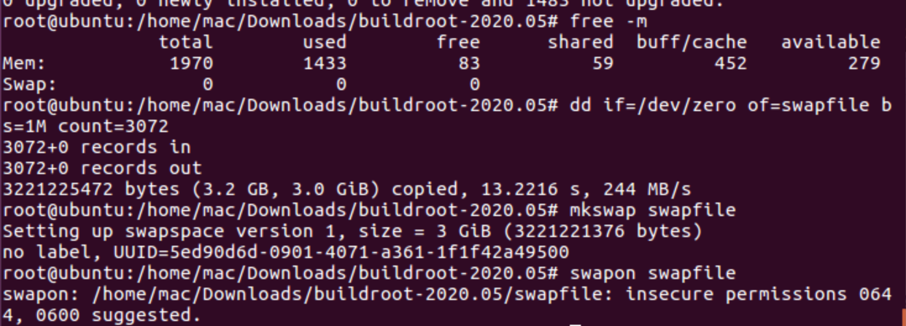

（针对硬盘空间不足：错误提示：no space for dictionary xxx：网上很多扩展根目录的方法都会导致数据消失，所以我使用gparted开源工具，用.iso文件作为启动盘，进入调整界面可以可视化调整根目录大小。）

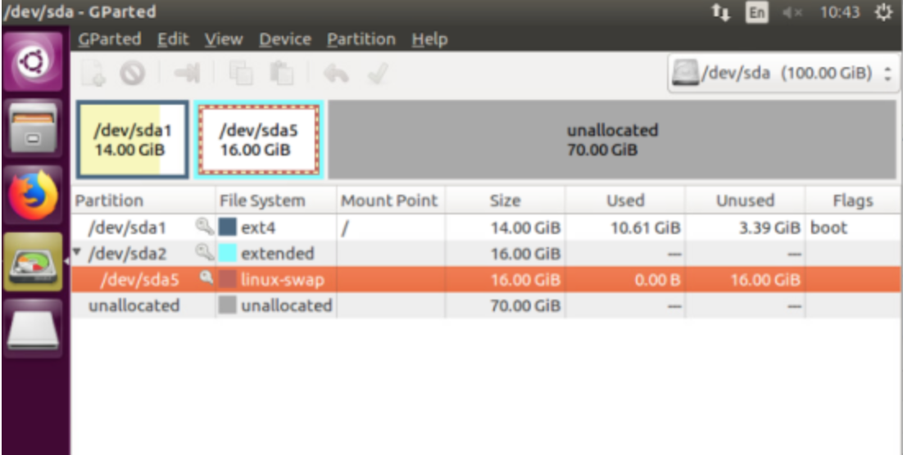

完成之后，安装模块，在终端中输入：make modules_install，安装模块即可。
编写的zzkscull.c,zzkscull.h,Makefile，如下文所示
执行make，insmod zzkscull.ko，cat /proc/devices，可以看到scull驱动程序被正确的插入到内核当中，设备编号为242：（另一个设备的创建和这个scull十分类似就是在scull.c的int scull_major = SCULL_MAJOR;代码中将SCULL_MAJOR替换为241即可）

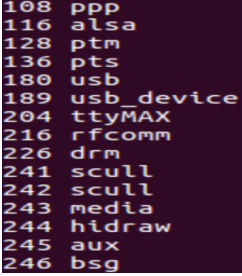

测试使用scull驱动：
首先在创建好的ext3文件系统/mydata目录下创建与该驱动程序相对应的文件节点mknod zzkscull c 242 0
使用ls查看创建好的驱动程序节点文件ls -al zzkscull
写一个简单的测试程序test.c，来对驱动程序进行测试,编译并执行该程序：

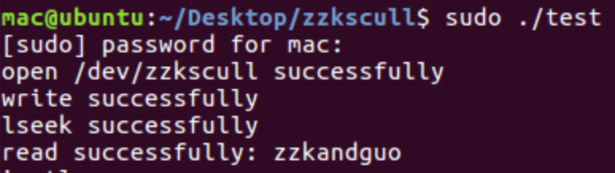

### 4.Socket多线程多节点通信设计
4.1 通信应用程序总体设计

我们的通信应用程序由一个中央控制Server节点和多个终端数据采集Client节点组成。
由于需要稳定、持续、少量的流式数据传输，我们采用TCP传输协议。

4.2 中央控制节点Server设计

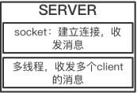

首先，在中央控制Server节点(Ubuntu主机)处，我们建立Server，其打开Socket监听主机ip下的指定端口号的TCP连接：

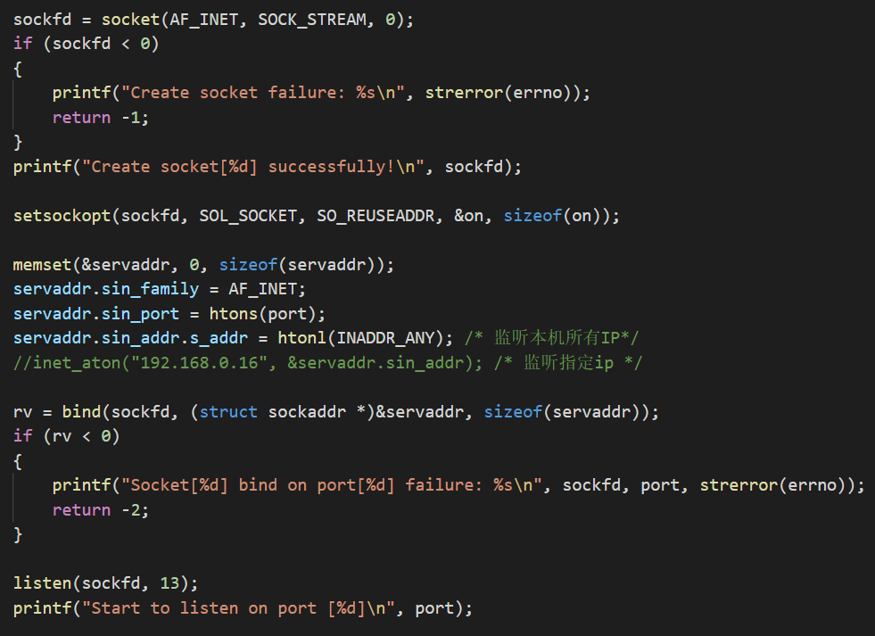

每当接到一个新的连接请求时创建一个新线程来处理当前连接，而原线程继续监听新的连接：

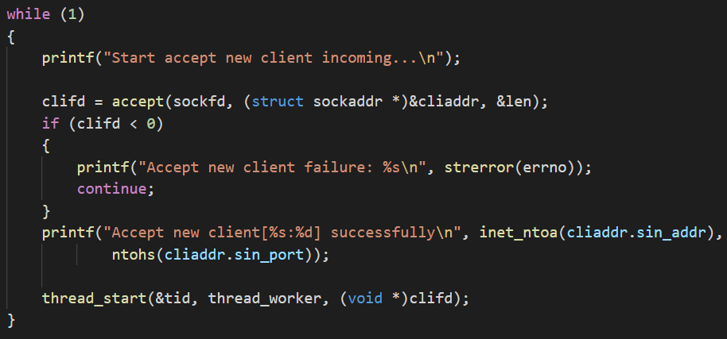

在每一个处理连接的线程中，持续读取当前数据采集节点发来的数据：

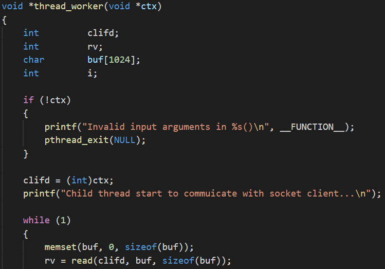

4.3 数据采集节点Client设计

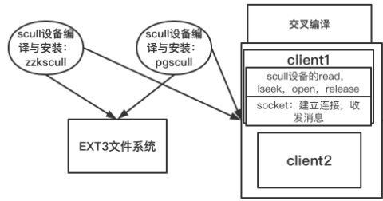

在数据采集节点端，我们首先打开Socket与中央控制节点进行连接：

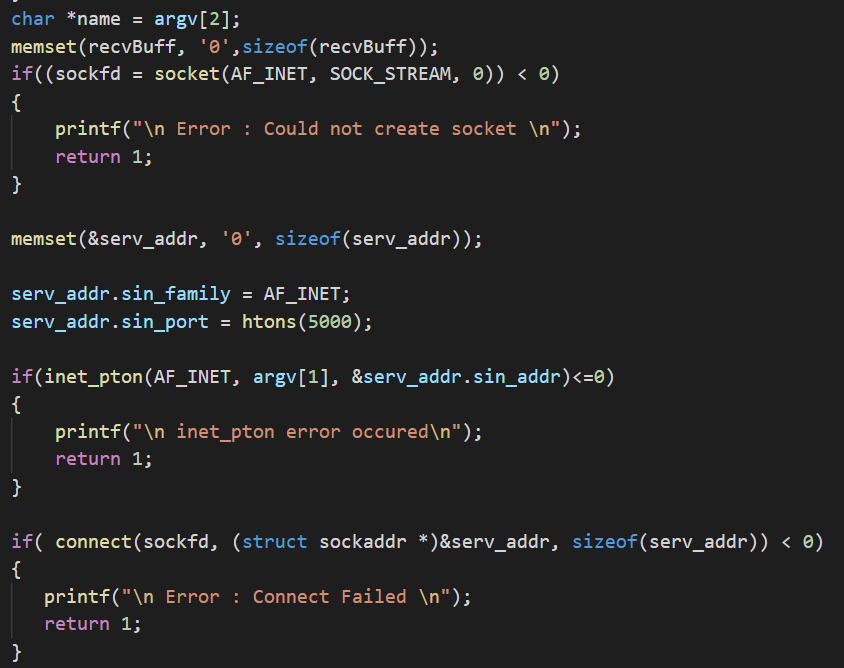

然后从Scull设备中读取设备输出：

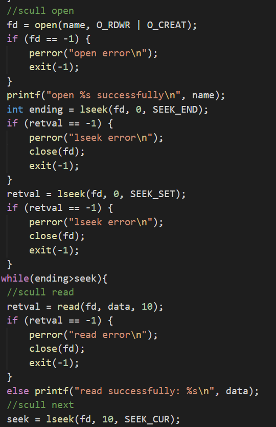

然后将读取内容发送到中央控制节点Server端：

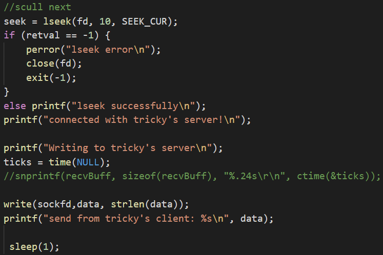

### 5.交叉编译通信应用程序
我们使用arm-linux-gnueabihf-gcc进行交叉编译

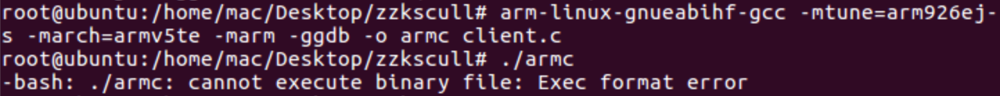

然后使用qemu-arm进行arm架构的模拟运行
运行时qemu-arm -L /usr/arm-linux-gnueabi ./armc 127.0.0.1 /mydata/zzkscull 
报错：/lib/ld-linux-armhf.so.3: No such file or directory
需要在编译的时候arm-linux-gnueabihf-gcc -mtune=arm926ej-s -march=armv5te -marm -ggdb -static -o armc client.c 
编译后即可运行。
我们首先打开中央控制Server节点(如下图左侧终端所示)，可以看到其成功打开Socket并开始监听，随后我们依次打开俩个数据采集Client节点（如下图右侧俩个终端所示），可以看到，俩个节点同时不断地向中央节点发送其由Scull设备读取的输出，而中央节点也成功地收集到了各个节点发来的信息。系统测试运行成功！

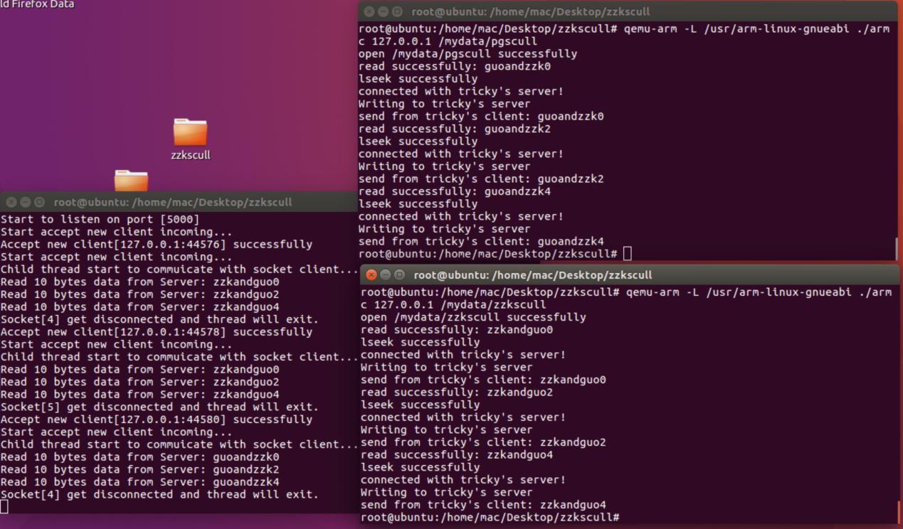

## 四、实验总结
本次实验我们从linux源代码开始重新构建、自定义了linux内核，自定义了u-boot，自定义了根文件系统，并将三者结合组成了定制的linux系统，最终通过qemu模拟该系统的运行。在自定义时，我们进行了kernel feature以及module的裁剪，对linux系统组成有了更充分的了解。

## 五、附实验源码

#### 源码请见 https://github.com/TrickyGo/999errors/blob/master/
